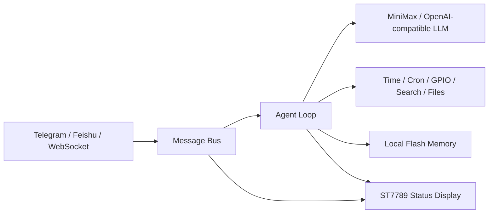

# MimiClaw ESP32-S3 Hardware & Model Adaptation

An extended embedded AI-agent firmware focused on **real hardware interaction, device-side status visualization, Chinese-oriented model access, and field debugging**.

[中文说明](README_CN.md) | [Custom development notes](docs/CUSTOM_DEVELOPMENT.md)

## What I Built

This repository documents and publishes my engineering work on top of the MimiClaw agent framework:

- **ST7789 status display subsystem**: implemented a 240x240 SPI LCD driver, framebuffer rendering, text wrapping, message previews, and expressive device states such as boot, Wi-Fi, listening, busy, ready, and error.
- **End-to-end agent visualization**: connected the display to startup, Wi-Fi onboarding, Telegram, Feishu, WebSocket, agent processing, and LLM error paths.
- **MiniMax model adaptation**: routed the Anthropic-compatible request path to MiniMax and selected `MiniMax-M2.7-highspeed` as the default model for Chinese-oriented usage.
- **Reliable tool execution rules**: strengthened the agent context so actions such as scheduling, time lookup, and hardware control must be completed through real tool calls before success is reported.
- **Hardware diagnostic CLI**: added I2C scanning and bus recovery, direct GPIO read/write/blink commands, and display reinitialization for board bring-up.
- **Feishu memory optimization**: moved large HTTP/WebSocket buffers and the Feishu task stack to PSRAM when available, with standard-memory fallbacks.

## System Flow



## Hardware Target

- ESP32-S3
- 16 MB Flash and 8 MB PSRAM recommended
- 1.54-inch ST7789 SPI LCD, 240x240
- Wi-Fi connection
- USB/UART for flashing and the diagnostic CLI

The ST7789 pin mapping and dimensions are configured in `main/mimi_config.h`.

## Quick Start

Install ESP-IDF v5.5 or later, then:

```bash
git clone https://github.com/ZhuoerYu2-c/MimiClaw-ESP32-AI-Agent.git
cd MimiClaw-ESP32-AI-Agent

cp main/mimi_secrets.h.example main/mimi_secrets.h
# Edit main/mimi_secrets.h with your own Wi-Fi, channel, and model credentials.

idf.py set-target esp32s3
idf.py fullclean
idf.py build
idf.py -p PORT flash monitor
```

Private credentials are intentionally excluded from this repository. Never commit `main/mimi_secrets.h`.

## Hardware Debug Commands

Use the UART console to validate wiring before debugging higher-level services:

```text
i2c_scan <sda> <scl>          Scan devices on selected I2C pins
i2c_diag <sda> <scl>          Inspect bus levels and send recovery pulses
pin_set <pin> <0|1>           Drive a GPIO low or high
pin_read <pin>                Read a GPIO input level
pin_blink <pin> [seconds]     Toggle a GPIO for physical verification
oled_force <sda> <scl> [addr] Reinitialize the configured display
```

## Key Implementation Areas

| Area | Main files | Contribution |
| --- | --- | --- |
| ST7789 UI | `main/display/lcd_display.c`, `main/display/oled_display.h` | SPI initialization, framebuffer, drawing, status faces, wrapped previews |
| Lifecycle integration | `main/mimi.c`, `main/agent/agent_loop.c` | Device and agent events reflected on the screen |
| Model access | `main/llm/llm_proxy.c`, `main/mimi_config.h` | MiniMax Anthropic-compatible endpoint and model defaults |
| Agent reliability | `main/agent/context_builder.c` | Tool-first execution constraints |
| Board diagnostics | `main/cli/serial_cli.c` | I2C/GPIO/display diagnostic commands |
| Feishu stability | `main/channels/feishu/feishu_bot.c` | PSRAM-preferred buffers and task stack |

## Current Limits

- The custom compact LCD font renderer currently displays ASCII text; non-ASCII message previews are sanitized.
- Pin assignments are board-specific and should be checked before flashing.
- A valid model API key and channel credentials are required for online interaction.

## Security

- Local secrets, build output, binaries, managed components, and machine-specific configuration are ignored.
- Use the example secrets file only as a template.
- Review GPIO assignments before connecting external hardware.

## Attribution and License

This extended implementation is based on the MIT-licensed [MimiClaw](https://github.com/memovai/mimiclaw) project by Ziboyan Wang. The original copyright notice is preserved in [LICENSE](LICENSE), with additional details in [NOTICE.md](NOTICE.md).
