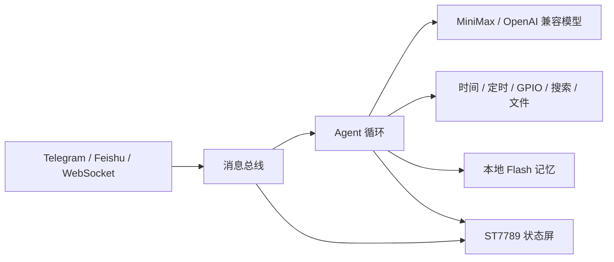

# MimiClaw ESP32-S3 硬件与模型适配版

这是一个面向真实硬件交互的嵌入式 AI Agent 固件。我在现有 Agent 框架上完成了显示交互、模型接口、硬件诊断、工具执行可靠性和内存稳定性等工程化扩展，让 ESP32-S3 不只是接收消息，还能呈现运行状态、操作硬件并方便现场排障。

[English](README.md) | [二次开发细节](docs/CUSTOM_DEVELOPMENT.md)

## 我的主要开发工作

### 1. 开发 ST7789 状态显示系统

为 1.54 英寸、240x240 的 ST7789 SPI 屏编写显示模块，包括初始化序列、帧缓冲区、分块刷新、基础图形、紧凑字体、文本换行和消息摘要预览。

显示界面会根据设备状态切换不同表情与信息：

- 开机与服务加载
- Wi-Fi 连接、配网与超时
- 收到 Telegram、Feishu、WebSocket 消息
- Agent 正在处理任务
- LLM 请求失败
- 系统就绪与发送结果

### 2. 适配 MiniMax 大模型 API

将 Anthropic 兼容请求链路适配到 MiniMax API，并将默认模型设置为 `MiniMax-M2.7-highspeed`，方便面向中文对话和国内模型服务场景使用。OpenAI 兼容链路仍可通过配置切换。

### 3. 提升 Agent 工具执行可靠性

补充严格的工具调用约束，要求 Agent 在报告“已完成”前真正调用对应工具。例如：

- 定时任务必须调用 `cron_add`
- 获取时间必须调用 `get_current_time`
- 硬件控制必须调用实际控制工具
- 工具成功返回后才能向用户确认结果

这部分用于减少 Agent 只回复文字、却没有真正执行操作的问题。

### 4. 开发硬件诊断 CLI

在串口控制台加入一组面向开发板调试的命令：

```text
i2c_scan <sda> <scl>          扫描指定引脚上的 I2C 设备
i2c_diag <sda> <scl>          检查总线电平并发送恢复脉冲
pin_set <pin> <0|1>           设置 GPIO 高低电平
pin_read <pin>                读取 GPIO 输入
pin_blink <pin> [seconds]     周期翻转 GPIO，辅助确认接线
oled_force <sda> <scl> [addr] 重新初始化显示模块
```

这些命令可以先验证引脚、接线和总线状态，再排查上层业务逻辑。

### 5. 优化 Feishu 通道的内存使用

针对 ESP32-S3 内存有限、网络报文较大的特点，为 Feishu HTTP/WebSocket 响应缓冲区增加 PSRAM 优先分配策略，并尝试将 Feishu 任务栈放入 PSRAM；当 PSRAM 不可用时自动回退到普通内存。

## 系统流程



## 关键代码

| 模块 | 主要文件 | 实现内容 |
| --- | --- | --- |
| ST7789 显示 | `main/display/lcd_display.c`、`main/display/oled_display.h` | SPI 初始化、帧缓冲、绘图、状态表情、消息预览 |
| 生命周期联动 | `main/mimi.c`、`main/agent/agent_loop.c` | 将网络、消息和 Agent 状态同步到屏幕 |
| 模型适配 | `main/llm/llm_proxy.c`、`main/mimi_config.h` | MiniMax Anthropic 兼容接口与默认模型 |
| 执行可靠性 | `main/agent/context_builder.c` | 强制真实工具调用后再报告结果 |
| 硬件诊断 | `main/cli/serial_cli.c` | I2C、GPIO 与显示诊断命令 |
| Feishu 优化 | `main/channels/feishu/feishu_bot.c` | PSRAM 优先缓冲区与任务栈 |

## 环境与硬件

- ESP-IDF v5.5+
- ESP32-S3，建议 16 MB Flash + 8 MB PSRAM
- 1.54 英寸 ST7789 SPI 屏，分辨率 240x240
- Wi-Fi
- USB/UART 串口

ST7789 引脚和显示尺寸在 `main/mimi_config.h` 中配置。烧录前请按照自己的开发板核对引脚。

## 编译与使用

```bash
git clone https://github.com/ZhuoerYu2-c/MimiClaw-ESP32-AI-Agent.git
cd MimiClaw-ESP32-AI-Agent

cp main/mimi_secrets.h.example main/mimi_secrets.h
# 在 main/mimi_secrets.h 中填写自己的 Wi-Fi、消息通道和模型凭据

idf.py set-target esp32s3
idf.py fullclean
idf.py build
idf.py -p PORT flash monitor
```

私密配置文件 `main/mimi_secrets.h` 不会上传到仓库，请勿提交真实密码、Token 或 API Key。

## 当前限制

- 自定义 LCD 紧凑字体目前只渲染 ASCII；非 ASCII 消息预览会进行清理，不能将它描述为中文字体显示。
- 不同开发板的引脚定义可能不同，需要自行调整。
- 在线对话需要配置有效的模型 API Key 和消息通道凭据。

## 引用与许可证

本项目是在 Ziboyan Wang 的 MIT 开源项目 [MimiClaw](https://github.com/memovai/mimiclaw) 基础上进行的扩展开发。原始版权声明保留在 [LICENSE](LICENSE)，补充说明见 [NOTICE.md](NOTICE.md)。
